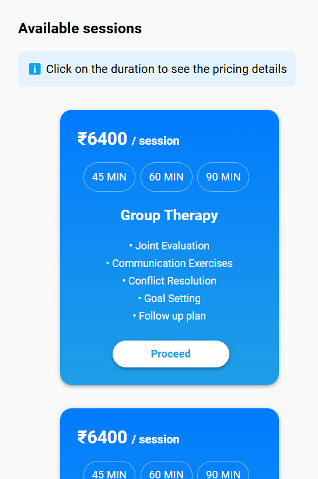
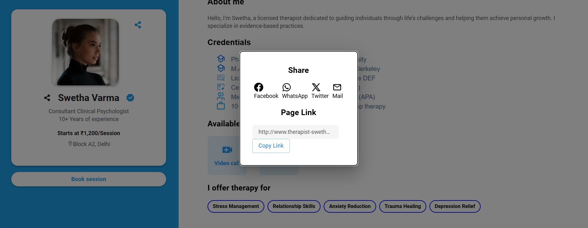

# Assignment Submission for Zenstreet AI

## Project Overview
This repository contains the completed assignment provided by **Zenstreet AI**. The project involves [briefly describe the task, e.g., creating a React-based UI component that displays availability information with icons and interactive features]. The solution focuses on clean design, responsive layout, and efficient use of Material-UI components.

---

## Features
- **Dynamic UI**: Utilized Material-UI and React to build visually appealing and functional components.
- **Responsive Design**: Ensured compatibility across different screen sizes and devices.
- **Icons Integration**: Used Material-UI icons and FontAwesome for visual representation.
- **Custom Styling**: Applied custom `sx` styling for consistent appearance.
- **Design**: Tried to make as similar as given by you in figma file


---

## Technologies Used
- **Next**: Frontend framework for building the UI.
- **Aceternity UI**: For prebuilt React components and styling.
- **Icons**: Used `@mui/icons-material` and `react-icons` for high-quality icons.

---

## Installation and Setup
To run the project locally, follow these steps:

1. Clone the repository:
   ```bash
   git clone https://github.com/harshvardhan119/zenstreet_assignment.git
   cd zenstreet_assignment
   ```

2. Install dependencies:
   ```bash
   npm install 
   ```
   or 
   npm install --force

3. Start the development server:
   ```bash
   npm run dev
   ```

4. Open your browser and navigate to:
   ```
   http://localhost:3000
   ```

---

## Folder Structure
```
├── src/
│   ├── components/       # All React components
│   ├── assets/           # Any images, icons, or static files
│   ├── App.js            # Main app component
│   ├── index.js          # Entry point
│   └── styles/           # Custom CSS or MUI theme files (if any)
├── public/
│   └── index.html        # Main HTML file
└── README.md             # Documentation
```

---

## How to Use
1. **Interactive UI**: The application includes a section displaying availability options with icons for:
   - In-person meetings
   - Video/Voice calls
2. Explore the design and functionality by interacting with the UI components.
3. The design is intended to be user-friendly and visually cohesive.

---

## Challenges and Learnings
- Learned efficient use of `Material-UI` components and `sx` styling for rapid development.
- Improved React skills by working with component reusability and state management.
- [Add any unique challenges or solutions you encountered.]

---

## Future Enhancements
- Add more interactivity, such as hover effects or tooltips.
- Implement backend integration for dynamic data fetching.
- Optimize the performance for larger datasets.

---

## Demo
[Add a link to a live demo or screenshots/gifs of your application.]

---

## Author
**Harsh**  
- [LinkedIn]https://www.linkedin.com/in/harsh-vardhan-singh-083721257
- [Portfolio]https://wonderful-biscuit-a18a77.netlify.app 

---

## License
This project is for educational purposes and is shared with **Zenstreet AI** as part of the assignment. 

---

## tried to make completely Responsive 





